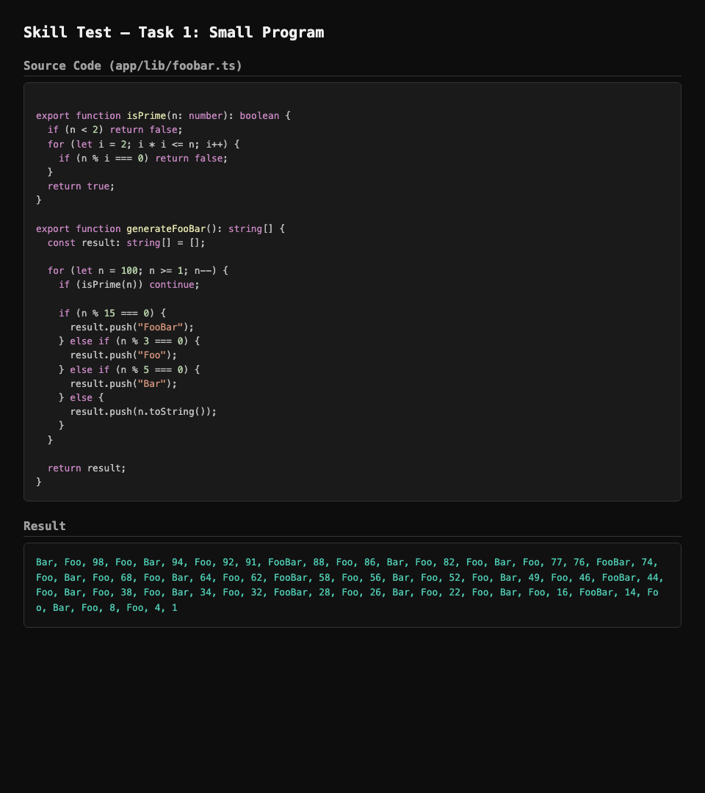

# Mini Program — Skill Test Task 1

Print numbers 1 to 100 in reverse order with these rules:

- Skip prime numbers
- Replace multiples of 3 with `Foo`
- Replace multiples of 5 with `Bar`
- Replace multiples of 15 with `FooBar`
- Print horizontally, comma-separated

## Result



## Tech Stack

| Technology | Version |
|---|---|
| [Next.js](https://nextjs.org) | 16.2.11 (App Router) |
| [React](https://react.dev) | 19.2.4 |
| [TypeScript](https://www.typescriptlang.org) | ^5 |
| [Tailwind CSS](https://tailwindcss.com) | ^4 |
| [pnpm](https://pnpm.io) | Package manager |

## Project Structure

```
.
├── app/
│   ├── lib/
│   │   └── foobar.ts       # Core logic: isPrime & generateFooBar
│   ├── page.tsx             # Next.js page rendering the output
│   ├── layout.tsx           # Root layout
│   └── globals.css          # Global styles (Tailwind)
├── scripts/
│   └── foobar.mjs           # Standalone Node.js script (no deps required)
└── screenshots/             # Screenshots for submission
```

## Getting Started

### Prerequisites

- [Node.js](https://nodejs.org) 20.9+
- [pnpm](https://pnpm.io/installation)

### Install & Run

```bash
# Install dependencies
pnpm install

# Run the Next.js dev server
pnpm dev
# Open http://localhost:3000

# Or run the standalone Node script
node scripts/foobar.mjs
```

### Build

```bash
pnpm build
pnpm start
```
